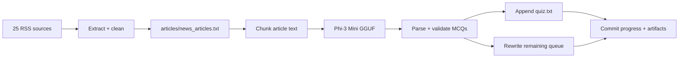

<div align="center">

<sub>Real photography by <a href="https://commons.wikimedia.org/wiki/File:Person_reading_a_newspaper_(Unsplash).jpg">Roman Kraft on Wikimedia Commons (CC0)</a>.</sub>

# CEUIL AI
### A two-stage news-to-MCQ factory powered by local inference and scheduled automation.

[](https://github.com/TanishC4444/CEUIL_AI/actions/workflows/news-scraper.yml)
[](https://github.com/TanishC4444/CEUIL_AI/actions/workflows/news-mcq-generator.yml)


[Architecture](#architecture) · [Stages](#pipeline-stages) · [Run](#run-locally) · [Tradeoffs](#engineering-tradeoffs)
</div>

---

## Overview

CEUIL AI connects a broad RSS collector to a batched local-language-model question generator. The scraper builds a cleaned article queue from 25 publishers/sections. A second workflow restores or downloads Phi-3 Mini, processes queued articles into structured MCQs, appends validated questions to `quiz.txt`, removes completed inputs, and commits progress so the next scheduled run can continue.

## Architecture



## Pipeline stages

### 1. Corpus builder

- Iterates up to 20 entries per feed.
- Extracts full bodies with Newspaper3k.
- Deduplicates against stored `Link:` records.
- Keeps long sentences with numbers or proper-noun candidates.
- Appends only cleaned articles above the minimum word threshold.
- Runs every five minutes and on scraper changes.

### 2. Question generator

- Runs every seven hours, manually, or on generator changes.
- Caches `Phi-3-mini-4k-instruct-q4.gguf` between runs.
- Filters configured blocked domains.
- Splits text into bounded word chunks.
- Prompts for structured educational MCQs.
- Parses model output and retains the unprocessed article queue.
- Uses a long, bounded Actions run and retries git pushes after rebasing.

## Run locally

```bash
git clone https://github.com/TanishC4444/CEUIL_AI.git
cd CEUIL_AI
python -m venv .venv
source .venv/bin/activate
python -m pip install feedparser newspaper3k "lxml[html_clean]" llama-cpp-python huggingface-hub

python news_scraper.py
MODEL_PATH=/path/to/Phi-3-mini-4k-instruct-q4.gguf \
INPUT_FILE=./articles/news_articles.txt \
python mcq_generator.py
```

## Durable processing model

The article file doubles as a work queue. Successful generation appends quiz material and writes only remaining articles back to the queue. Workflows then commit both files. This allows multi-hour processing to advance across independent stateless runners.

## Repository map

```text
CEUIL_AI/
├── .github/workflows/
│   ├── news-scraper.yml
│   └── news-mcq-generator.yml
├── articles/news_articles.txt   persistent work queue
├── news_scraper.py              acquisition and cleaning
├── mcq_generator.py             local model generation
└── quiz.txt                     accumulated question bank
```

## Engineering tradeoffs

- **Decoupled stages** let scraping stay fast while inference runs less frequently.
- **Model caching** avoids repeated multi-gigabyte downloads when the Actions cache is available.
- **File-backed queues** eliminate database infrastructure but produce large commits and weak concurrency guarantees.
- **Generative validation** filters malformed responses, but no automated content-correctness evaluation exists.
- **Long-running CI** maximizes free hosted processing time, but jobs can time out and model inference is CPU-bound.
- The checked-in quiz dataset is tens of megabytes; release artifacts or object storage would scale better.

## Skills demonstrated

Two-stage data pipelines · local LLM deployment · prompt engineering · queue/checkpoint design · workflow matrices and caching · resilient git automation · text extraction · schema validation

## Resume-ready highlight

> Designed a resumable news-to-question pipeline that collects and filters a 25-source corpus, runs cached Phi-3 Mini inference on GitHub Actions, validates generated MCQs, and checkpoints queue progress across stateless jobs.

## License

No license file is currently included.

